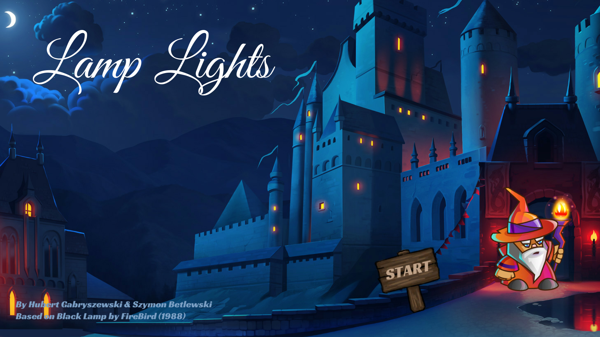
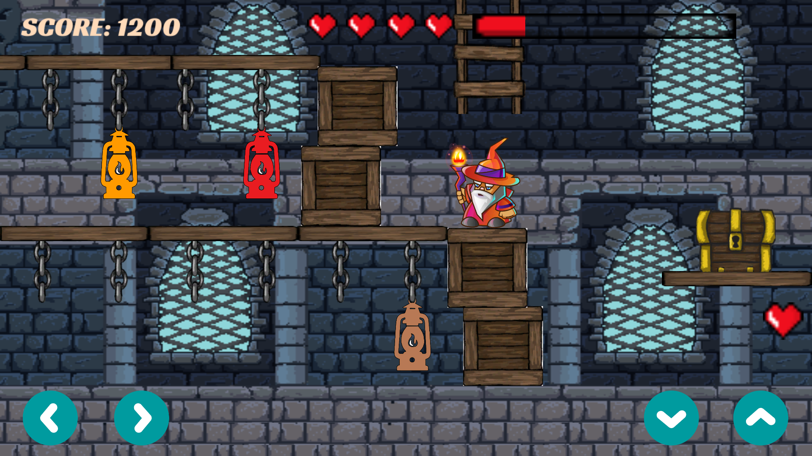
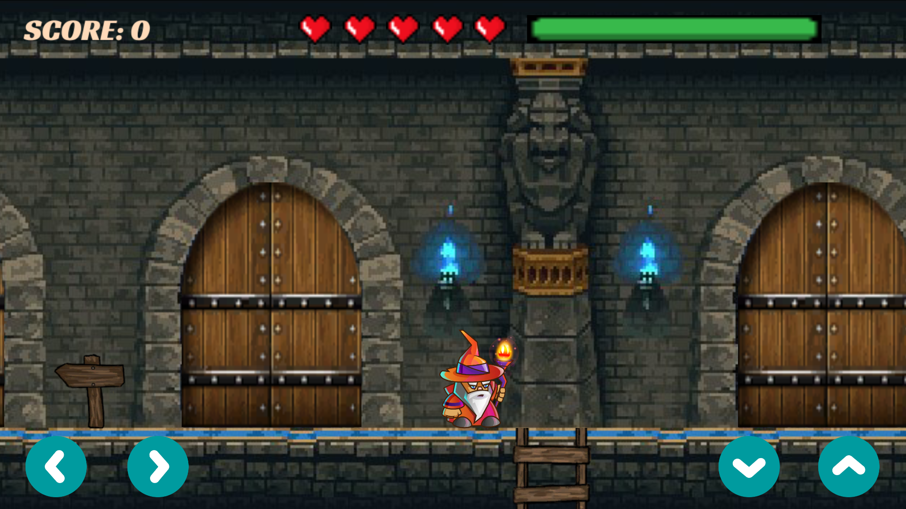
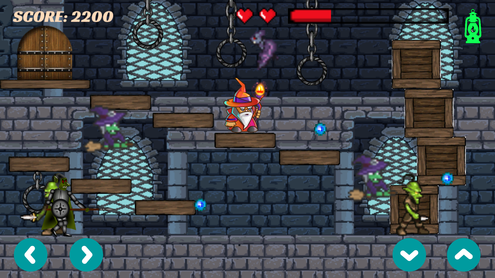

# Lamp Lights - Unity 2D Game
This game is based on  [Black Lamp](https://en.wikipedia.org/wiki/Black_Lamp_(video_game\)) 
originally published by Firebird Software in 1988.  
You can play it on your computer as well as also on a mobile device.

## Usage
If you want to install it on Android, just download **apk** file in **Build/Android** folder and run it on your mobile device.  
In order to play this game on your computer, you would have to download all **Build/Windows** folder and run **LampLights.exe** file. 
It should work perfectly on operating systems like: Windows, Linux and Mac OS.

## Instructions:
You are a wizard who has to collect all color lamps to save the castle. The lamps are located in different rooms. 
Your aim is to bring them to the magazine. But be aware, you are not immortal! 
There are many enemies that have powers and can kill you.

## Some photos:

## Authors:
* [hubigabi](https://github.com/hubigabi)
* [betlewski](https://github.com/betlewski)